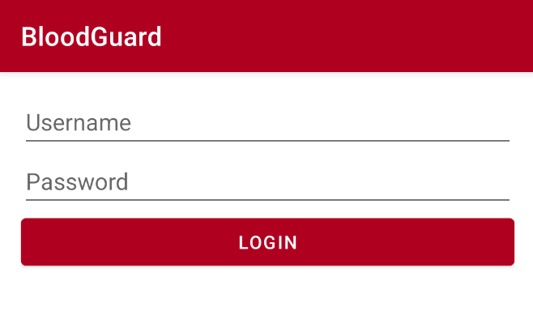
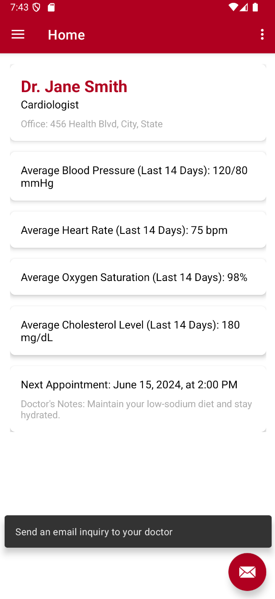
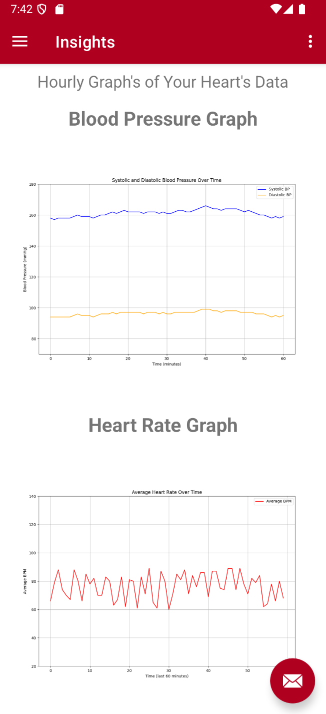
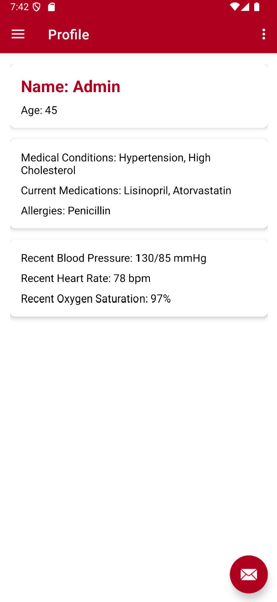
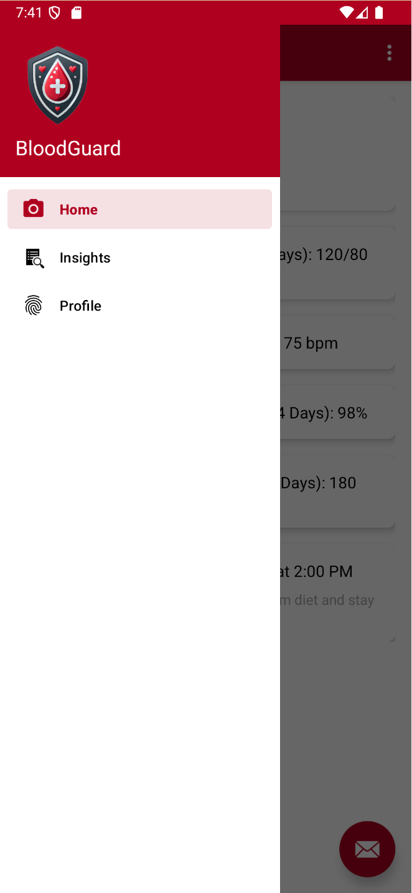

# Blood Guard

Blood Guard is an AI-powered health monitoring application designed to empower cardiovascular patients. Through seamless integration with wearable technology, Blood Guard tracks essential health metrics, providing real-time, data-informed insights to support users on their journey to better health and recovery.

## Mission Statement

Blood Guard aims to empower cardiovascular patients by providing continuous, data-driven insights. Our app promotes proactive health management through intelligent data analysis, visualization, and seamless user experience.

## Why Blood Guard?

Cardiovascular diseases are a leading cause of death globally, with 17.9 million deaths each year. Blood Guard seeks to combat this by offering a tool for early detection and lifestyle adjustments, thereby supporting preventative care and reducing medical costs.

## Features

- **Real-Time Health Tracking**: Integrated with wearable devices, Blood Guard tracks key health metrics such as blood pressure and cholesterol.
- **AI-Powered Insights**: Our machine learning model analyzes user data, delivering actionable insights into health trends and recovery progress.
- **User-Friendly Visualization**: Real-time graphs and a color-coded calendar offer easy-to-understand progress reports.
- **Direct Communication with Healthcare Providers**: Facilitate direct communication with medical professionals through the app for personalized guidance.

## Screenshots

### App Logo

### Login Screen

### Main Dashboard
The dashboard provides an overview of recent health metrics and upcoming appointments.

### Insights
Real-time graphs track blood pressure and heart rate trends.

### Profile
User profile displays medical conditions, medications, allergies, and recent health metrics.

### Sidebar Navigation
Quick access to Home, Insights, and Profile.

## How Blood Guard Works

1. **Data Collection and Model Training**: We use patient data, cleaned and structured with Python, to train a machine learning model that identifies health trends.
2. **Integration and Deployment**: The model is deployed on a Kotlin-based mobile app connected to a wearable device, enabling real-time analysis and insights.
3. **Continuous Monitoring**: The wearable device tracks daily metrics, updating the app with visual reports and adapting the model to improve predictive accuracy.
